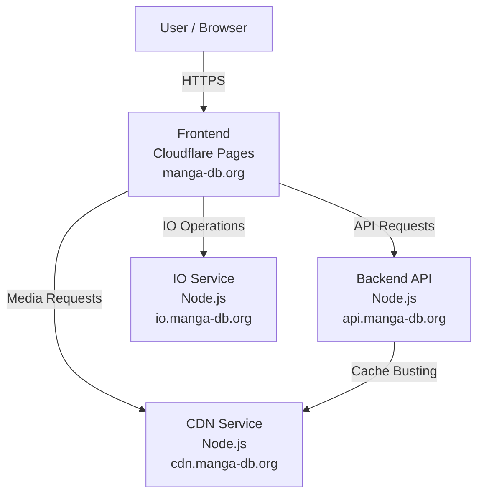

# Architecture

## Diagram

## Technology Stack Overview

This section describes the main technologies used across the system and how they relate to each component.

---

### Frontend

The frontend is built using **Nuxt** and runs on **Cloudflare Pages**.

- **Framework:** Nuxt `4.1.1`
- **Server Engine:** Nitro `2.12.5`
- **Role:**  
  - Renders the user-facing application  
  - Communicates with backend services over HTTPS  
  - Requests media and assets from the CDN service  

---

### Backend Services

All backend services are implemented as **Node.js applications**.

- **Runtime:** Node.js `16.5.0`
- **Services include:**  
  - Backend API (`api.manga-db.org`)  
  - CDN service (`cdn.manga-db.org`)  
  - IO service (`io.manga-db.org`)

**Responsibilities:**
- Handle business logic and request orchestration  
- Serve and manage media assets  
- Perform file and I/O-related operations  

---

### Database

The system uses **MariaDB** as its relational database.

- **Database Engine:** MariaDB `10.4`
- **Usage:**  
  - Stores application data and metadata  
  - Accessed primarily by the backend API  

---

### Technology Relationships

- The **Nuxt frontend** communicates with backend Node.js services via HTTPS.
- **Node.js services** interact with the MariaDB database for persistent storage.
- Media and file operations are handled through dedicated backend services to keep concerns separated.

---

This separation of technologies and responsibilities helps keep the system modular, scalable, and easier to maintain.