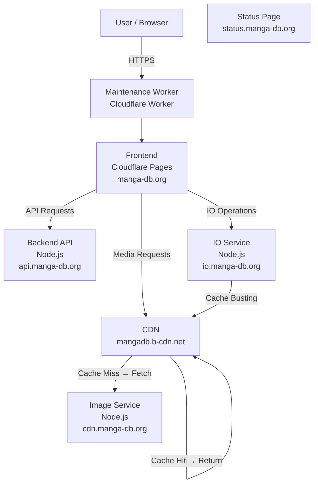

# Architecture

## Diagram

## Technology Stack Overview

This section describes the main technologies used across the system and how they relate to each component.

### Maintenance Worker

A Cloudflare Worker sits between the user and the frontend to handle maintenance mode.

**Role:**
- Intercepts user requests to the frontend
- Can serve a maintenance page or forward requests to the frontend
- Allows toggling maintenance mode without redeploying the frontend

### Frontend

The frontend is built using **Nuxt** and runs on **Cloudflare Pages**.

- **Framework:** Nuxt `4.1.1`
- **Server Engine:** Nitro `2.12.5`
- **Role:**  
  - Renders the user-facing application  
  - Communicates with backend services over HTTPS  
  - Requests media and assets from the CDN service  

### Backend Services

All (self hosted) backend services are implemented as **Node.js applications**.

- **Runtime:** Node.js `16.5.0`
- **Services include:**  
  - Backend API (`api.manga-db.org`)  
  - Image service (`cdn.manga-db.org`)
  - CDN (`mangadb.b-cdn.net`) - hosted on Bunny Net
  - IO service (`io.manga-db.org`)

**Responsibilities:**
- Handle business logic and request orchestration  
- Serve and manage media assets  
- Perform file and I/O-related operations

### Status Page

The system includes a **status page** (`status.manga-db.org`) for monitoring.

**Role:**

  * Monitors the health and uptime of all services
  * Provides visibility into the frontend, backend, IO, and CDN services

### Database

The system uses **MariaDB** as its relational database.

- **Database Engine:** MariaDB `10.4`
- **Usage:**  
  - Stores application data and metadata  
  - Accessed primarily by the backend API  

### Technology Relationships

- The **Maintenance Worker** intercepts user requests and forwards them to the frontend when the site is operational.
- The **Nuxt frontend** communicates with backend Node.js services over HTTPS.
- Media and file requests go through the **CDN**, which fetches from the **Image Service** only when the content is not cached.
- **Node.js services** interact with the **MariaDB database** for persistent storage.
- The status page monitors all services to provide system health visibility.

This separation of technologies and responsibilities helps keep the system modular, scalable, and easier to maintain.
