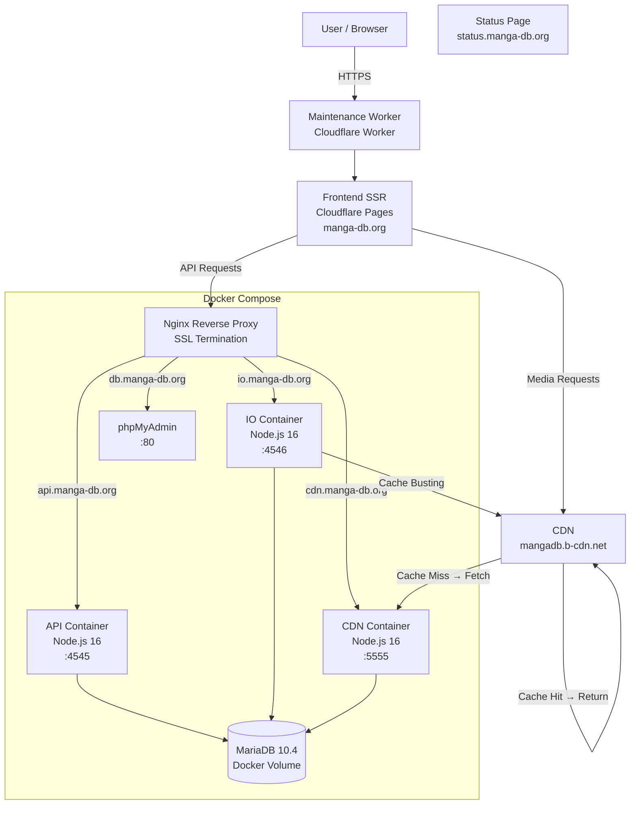

# Architecture

## Diagram

```mermaid
graph TD
    U[User / Browser]

    U -->|HTTPS| MW[Maintenance Worker<br/>Cloudflare Worker]

    MW --> FE[Frontend SSR<br/>Cloudflare Pages<br/>manga-db.org]

    FE -->|API Requests| NGINX[Nginx Reverse Proxy<br/>SSL Termination]
    FE -->|Media Requests| CDN[CDN<br/>mangadb.b-cdn.net]

    NGINX -->|api.manga-db.org| API[API Container<br/>Node.js 16<br/>:4545]
    NGINX -->|io.manga-db.org| IO[IO Container<br/>Node.js 16<br/>:4546]
    NGINX -->|cdn.manga-db.org| IMG[CDN Container<br/>Node.js 16<br/>:5555]
    NGINX -->|db.manga-db.org| PMA[phpMyAdmin<br/>:80]

    CDN -->|Cache Miss → Fetch| IMG
    CDN -->|Cache Hit → Return| CDN
    IO -->|Cache Busting| CDN

    API --> DB[(MariaDB 10.4<br/>Docker Volume)]
    IO --> DB
    IMG --> DB

    STATUS[Status Page<br/>status.manga-db.org]

    subgraph Docker Compose
        NGINX
        API
        IO
        IMG
        PMA
        DB
    end
```

## Domain Architecture

| Subdomain | Service | Hosting |
|---|---|---|
| `manga-db.org` | Frontend (Nuxt SSR) | Cloudflare Pages |
| `api.manga-db.org` | Backend API | Docker → Nginx → `api:4545` |
| `io.manga-db.org` | File service | Docker → Nginx → `io:4546` |
| `cdn.manga-db.org` | Image CDN | Docker → Nginx → `cdn:5555` |
| `mangadb.b-cdn.net` | Public CDN | Bunny Net |
| `db.manga-db.org` | phpMyAdmin | Docker → Nginx → `phpmyadmin:80` |
| `status.manga-db.org` | Status page | External monitoring |

## Technology Stack Overview

### Maintenance Worker

A Cloudflare Worker sits between the user and the frontend to handle maintenance mode.

**Role:**
- Intercepts user requests to the frontend
- Can serve a maintenance page or forward requests to the frontend
- Allows toggling maintenance mode without redeploying the frontend

### Frontend

The frontend is built using **Nuxt** and runs on **Cloudflare Pages** with SSR via Cloudflare Workers.

- **Framework:** Nuxt `4.1.1`
- **Server Engine:** Nitro `2.12.5` with `cloudflare-pages` preset
- **Rendering:** Server-side rendering (SSR) for SEO and Open Graph tags
- **Role:**
  - Renders the user-facing application with SSR
  - Communicates with backend services over HTTPS
  - Requests media and assets from the CDN service

### Deployment Zones

| Zone | Git Branch | Purpose |
|---|---|---|
| **prod-zone** | `main` | Production deployment |
| **dev-zone** | `development` | Development/staging deployment |

### Backend Services (Docker)

All backend services run as **Docker containers** on a virtual server, orchestrated by **Docker Compose** with an **Nginx** reverse proxy for SSL termination.

- **Runtime:** Node.js `16` (LTS)
- **Container orchestration:** Docker Compose
- **Reverse proxy:** Nginx (Alpine) with Cloudflare origin certificates
- **Services:**

| Container | Entry Point | Port | Purpose |
|---|---|---|---|
| `api` | `node server.js` | 4545 | REST API |
| `io` | `node server.js --is-file-service` | 4546 | File upload/serving |
| `cdn` | `node image-cdn.js` | 5555 | Image delivery + caching |
| `mariadb` | — | 3306 | Database |
| `phpmyadmin` | — | 80 | Database admin UI |
| `nginx` | — | 80, 443 | Reverse proxy + SSL |

The `api`, `io`, and `cdn` containers use the same Docker image (`mangalib-backend`) with different commands.

### CDN (Bunny Net)

- **URL:** `mangadb.b-cdn.net`
- **Role:** Public-facing CDN that caches images from the origin image service (`cdn.manga-db.org`)
- On cache miss, fetches from the Docker CDN container
- The IO service triggers cache busting on Bunny Net when media is updated

### Status Page

The system includes a **status page** (`status.manga-db.org`) for monitoring.

**Role:**
- Monitors the health and uptime of all services
- Provides visibility into the frontend, backend, IO, and CDN services

### Database

The system uses **MariaDB** as its relational database.

- **Database Engine:** MariaDB `10.4`
- **Storage:** Docker named volume (`db_data`), persists across container restarts
- **Usage:**
  - Stores application data and metadata
  - Accessed by the API, IO, and CDN containers

### Technology Relationships

- The **Maintenance Worker** intercepts user requests and forwards them to the frontend when the site is operational
- The **Nuxt frontend** runs SSR on Cloudflare Workers and communicates with backend Docker services over HTTPS
- Media and file requests go through the **Bunny Net CDN**, which fetches from the **Docker CDN container** only when content is not cached
- **Docker containers** share a compose network and access **MariaDB** via the internal `mariadb` hostname
- **Nginx** handles SSL termination using Cloudflare origin certificates and routes external traffic to the correct container
- The **media directory** is bind-mounted from the host filesystem and shared between the `api`, `io`, and `cdn` containers
